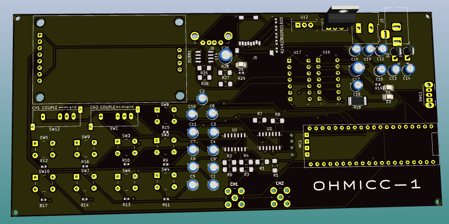
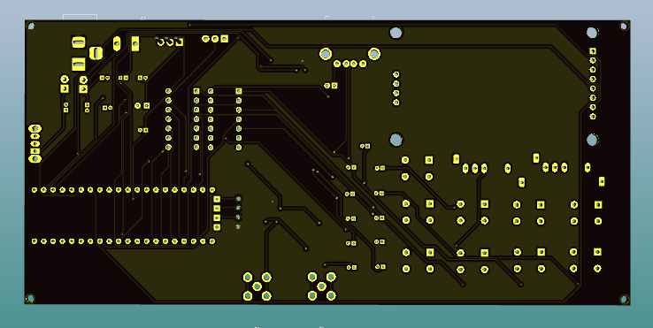
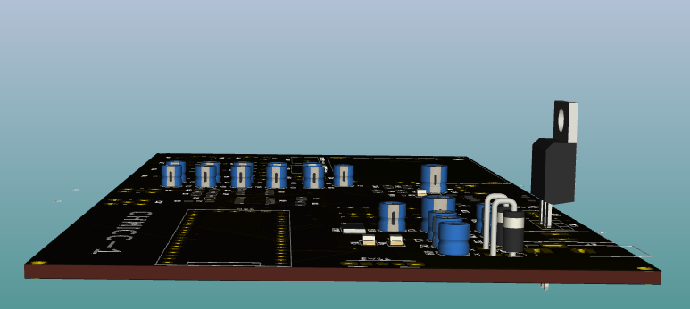

# basic-oscilloscope
Basic Digital Storage Oscilloscope

## Introduction
This oscilloscope uses an STM32F103C8T6 blue pill board as the main MPU for processing and display of output

## Specifications
| Spec | Value |
| ----- | -------|
|Analog bandwidth| 0 - 500kHz|
|Number of channels| 2|
|Sample Rate| 2M Samples/s (configurable)|
|RAM| 2GB (External)|
|Processor| STM32F103C8T6|
|CPU-speed| 72MHz|
|Power input| 9V battery of 12V DC jack input|
|Current| 150mA|
|Screen size| 1.8”|
|Maximum input voltage| 50V pk-pk|
|Time base range| 10uS/Div - 500s/Div|
|Storage| USB-2.0 External flash drive|
|Coupling| AC, DC, GND|
|Input impedance| 1MOhm|
|Record length| 1024|

### Top View

### Bottom View

### Left View

### Right View

